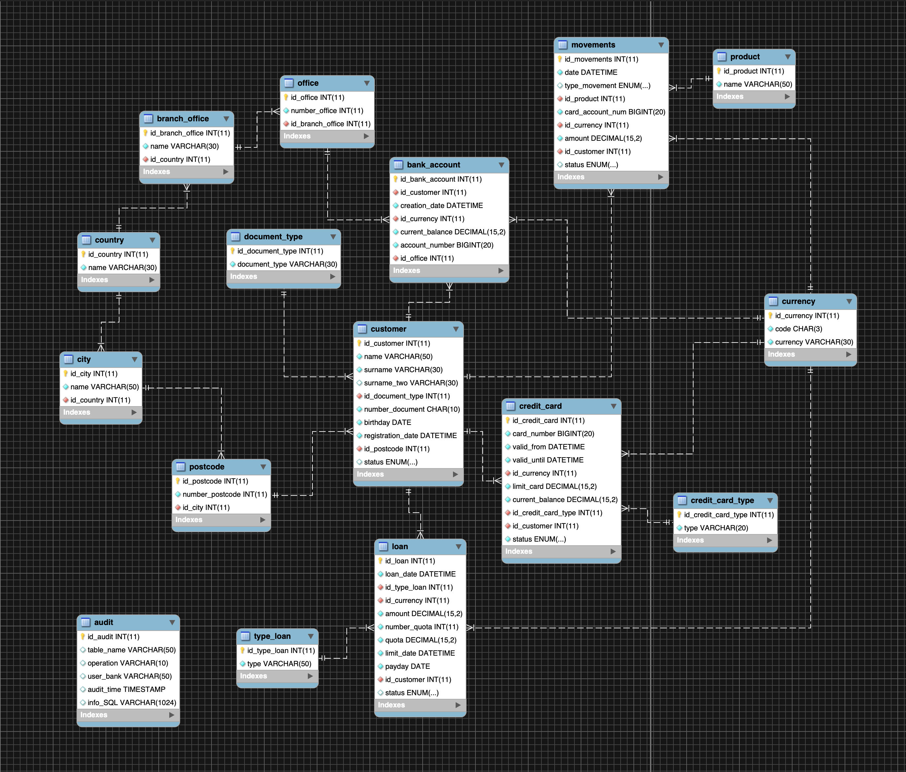
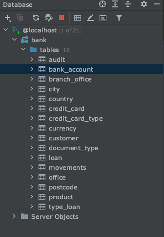
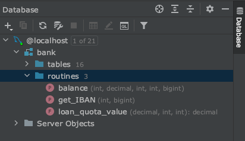
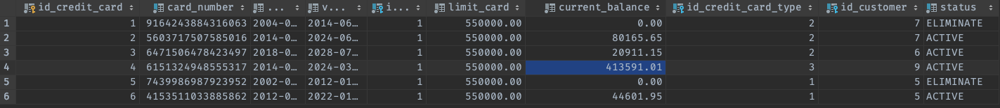

# bank_sql_project

This is the project that I made as SQL course's final assigment. I really enjoyed, and learned so much from it.

The task was to create a bank that include function, procedure and trigger.

The bank project was organized in three files:

- `01_bank_tables.sql` 
  
  Creating all tables
  

- `02_functions_procedures_triggers.sql`
  
  Creating functions, procedures, triggers
  

- `03_bank_data.sql` 

    Inserting data

You can find below the project's diagram using MySql Workbench.



The `audit` table is the only that no has connection with the rest of the tables, because the triggers will be working in this table.

## Creating tables

First, the schema creation. We need to create a schema where we can create the tables in it. 

`CREATE DATABASE bank;`

Then it would be: 

```mysql
# if bank exist in our database, we delete it to start fresh.
DROP DATABASE IF EXISTS bank;

# creation database bank
CREATE DATABASE bank;

# selection database bank
USE bank;
```

Now, the bank database is created, the other tables could be created using this instruction:

```mysql
# creation catalog table:  document_type
CREATE TABLE document_type(
	id_document_type INT AUTO_INCREMENT PRIMARY KEY,
    document_type VARCHAR (30) UNIQUE NOT NULL 
);
```
This is a catalog table, is using in foreign key in other tables. 

In this case, the catalog table will be used by the `customer` table:

```mysql
# creation table:  customer
CREATE TABLE customer(
                       id_customer INT AUTO_INCREMENT PRIMARY KEY,
                       name VARCHAR (50) NOT NULL,
                       surname VARCHAR (30) NOT NULL,
                       surname_two VARCHAR (30),
                       id_document_type INT NOT NULL,
                       number_document CHAR(10) UNIQUE NOT NULL,
                       birthday DATE NOT NULL,
                       registration_date DATETIME NOT NULL,
                       id_postcode INT NOT NULL,
                       status ENUM ('ACTIVE','DISABLED','ELIMINATE'),
                       INDEX customer_id (id_customer),
                       INDEX surname (surname),
                       INDEX num_document (number_document),
                       INDEX status(status),
                       FOREIGN KEY (id_document_type)
                       REFERENCES document_type(id_document_type),
                       FOREIGN KEY (id_postcode)
                       REFERENCES postcode(id_postcode)
);
```
The primary key is AUTO_INCREMENT in all tables

The foreign keys in `customer` table are:

- `id_document_type` from `document_type` table 
- `id_postcode` from `postcode` table.

All columns are NOT NULL, so, we need to put all values when we will insert a record. The only exception would be: `surname_two`. 
This column could be null because not all people have double surname.

When all the tables were created, the structure will look like this: 



## Functions, Procedures, Triggers

In the second file `02_functions_procedures_triggers.sql` I created the functions, procedures and triggers that the project required.
When those are created, we can see a new folder - `routines` - that was created just below the `tables` folder. 
In this folder are the function and procedures.




### Functions

I created only one function that is used when new value is inserted in `loan` table.

`loan_quota_value(amount DECIMAL(15,2), quotas INT, type_loan INT)` 

This function returns the monthly fee including taxes. That could be a personal, or a mortgage loan.
The result is then inserted in the `quota`column in `loan`table.

### Procedures

- `balance(int, decimal, int, bigint)`
- `get_IBAN(int, bigint)`

#### balance(int, decimal, int, bigint)

This procedure is to get the current balance for each customer in `bank_account` and `credit_card` tables when `movements` table is updated.
The procedure is called by a trigger, so, we only need to reload this tables after insert new values in `movements` table and see that the `current_balance` column was properly updated.

i.e. in `credit_card` table : These are the values that I inserted before.


Now, if insert new values in `movements` table, the `credit_card` table will change:

```mysql
INSERT INTO movements
    (date, type_movement, id_product, card_account_num, id_currency, amount, id_customer, status)
    VALUES ('2019-02-10 11:57:41', 'PURCHASE', 2, 6151324948555317, 1 , -350000.20, 9, 'APPROVED');

```



Now, if we insert again the same values in `movements` table, the status of id customer 9, will change to `LOCK`, 
because, the current balance is bigger than the limit card.


#### get_IBAN(int, bigint)

With this procedure I tried to create a similar formatter than the original IBAN using `concat()`.
So, I used letters to corresponding country and numbers are the international numerical prefix.
Then, the banking entity is a random number that I created inside the procedure.
the Number office comes from `office` table, the control number is the length of the customer's full name and
finally, the account number.

i.e. 
```mysql
call get_IBAN(9, 1383553535);
```
The first param is the id_customer, and the second is the account number.


## Triggers

The triggers work in `audit` table, 
this is where all information, that was changed, will be insert in.
All triggers will be working when `customer`, `load` and `bank_account` tables are changed (INSERT, UPDATE, DELETE).


